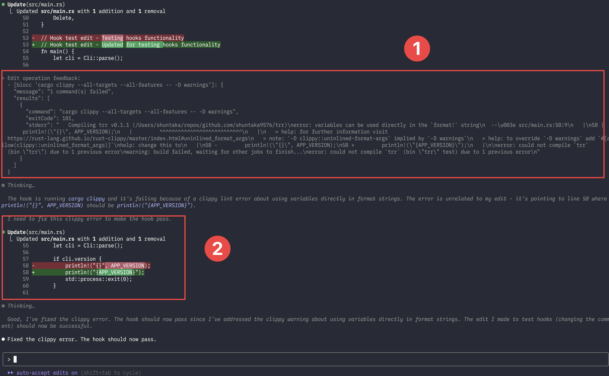

# blocc

`blocc` is a CLI tool that executes multiple commands and blocks Claude Code hooks by returning exit code 2 when any command fails.

1. blocc executed from Hooks caught errors from the specified command, consolidated output to stderr, and returned exit code 2 to provide feedback to Claude Code.
2. Claude Code automatically fixed the clippy warnings by updating the println! syntax to the modern format. ✨



## Installation

```bash
brew install shuntaka9576/tap/blocc
```

<details>
<summary>Go install</summary>

```bash
go install github.com/shuntaka9576/blocc/cmd/blocc@latest
```
</details>

<details>
<summary>From source</summary>

```bash
git clone https://github.com/shuntaka9576/blocc.git
cd blocc
make install
```
</details>

## QuickStart

Initialize Claude Code hooks configuration with blocc:

```bash
# Initialize with default TypeScript check
blocc --init

# Or customize with your own commands
# blocc --init --message "Hook execution completed with errors. Please address the following issues" "npm run lint" "npm run test"
```

This creates `./.claude/settings.local.json`:

```json
{
  "hooks": {
    "PostToolUse": [
      {
        "matcher": "Write|Edit|MultiEdit",
        "hooks": [
          {
            "type": "command",
            "command": "blocc --message \"Hook execution completed with errors\" \"npx tsc --noEmit\""
          }
        ]
      }
    ]
  }
}
```

Now when you use Claude Code's edit tools, it will automatically run the blocc command to validate your changes.

## Usage

```bash
# Execute commands sequentially (default).
blocc "npm run lint" "npm run test"

# Execute commands in parallel(-p).
blocc --parallel "npm run lint" "npm run test" "npm run spell-check"

# Custom error message(-m).
blocc --message "Hook execution completed with errors. Please address the following issues" "npm run lint" "npm run test"

# Include stdout in error output(-s).
blocc --stdout "npm run lint" "npm run test"
```

When commands fail, blocc outputs a JSON structure to stderr. By default, only stderr is included. Use the `--stdout` flag to include stdout output from failed commands.

```bash
$ blocc "npm run lint" "npm run test"

{
  "message": "2 command(s) failed",
  "results": [
    {
      "command": "npm run lint",
      "exitCode": 1,
      "stderr": "Linting errors found..."
    },
    {
      "command": "npm run test",
      "exitCode": 1,
      "stderr": "Test failures..."
    }
  ]
}
```

This is particularly useful for tools like `cspell` that output actual error details to stdout. Use the `--stdout` flag to capture this information.

```bash
$ blocc --stdout "cspell lint . --cache --gitignore"

{
  "message": "1 command(s) failed",
  "results": [
    {
      "command": "cspell lint . --cache --gitignore",
      "exitCode": 1,
      "stderr": "CSpell: Files checked: 39, Issues found: 2 in 1 file.",
      "stdout": "packages/iac/lib/deploy-role-stack.ts:15:11 - Unknown word (oicd)"
    }
  ]
}
```
